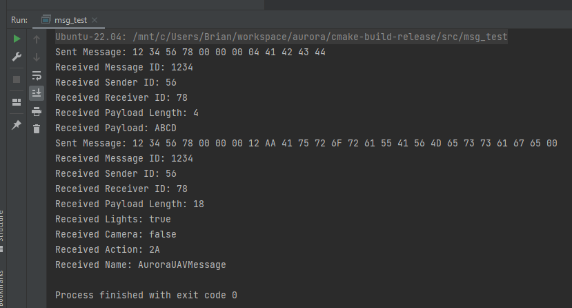

# Aurora Messages

A simple C++17 set of messages that demonstrate bitwise field parsing. The project is structured following 
[pitchfork](https://github.com/vector-of-bool/pitchfork) guidelines and has been tested on Ubuntu 22.04 Linux.

## Building

Building the project is done with CMake. It has been tested using GCC 11.4.0. Typical CMake workflow can be
followed:

1. `mkdir build && cd build`
2. `cmake ..`
3. `make`

### Required Dependencies

- catch2

##### Ubuntu

Install using apt:

```
sudo apt install catch2
```

##### RHEL

Install using yum/dnf:

```
sudo dnf install catch2-devel
```

## Cleaning the Project

Run `make clean` from within the CMake build tree.

## Running the Application

Run `make all` followed by `./src/msg_test` from the root of the `build` directory.



## Running Tests

Run `make all` followed by `make test` from the root of the CMake `build` tree.
